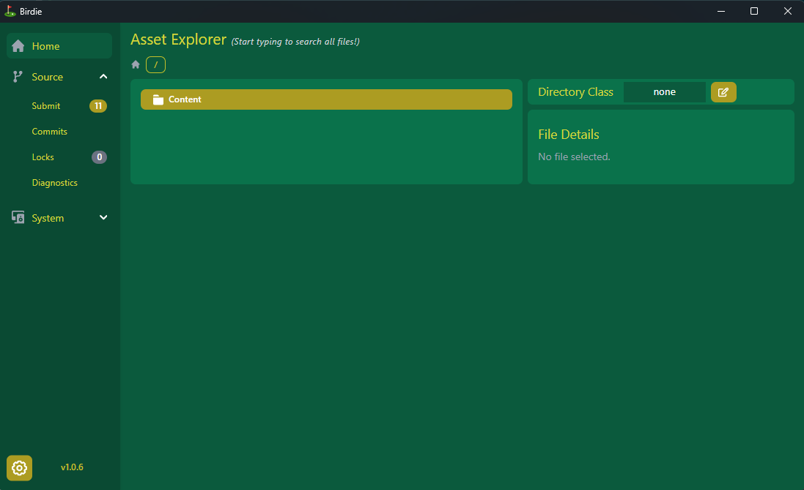

# Birdie

Birdie is a desktop application for managing game assets through Git. It is very early in development.



Features:

- Download asset files on-demand. In a standard Git LFS workflow, `git pull` would automatically download any files changed upstream, but this can be slow and inefficient for large files, especially if those files are irrelevant to the current user.
- Lock assets using Git LFS file locking.
- View repo history

## Sample Git configuration

Birdie expects repositories to be configured for Git LFS in a specific way. Here's an example `.gitattributes` file:

```gitattributes
[attr]lfs filter=lfs diff=lfs merge=binary -text
[attr]lock filter=lfs diff=lfs merge=binary -text lockable
[attr]lockonly lockable
[attr]lfstext filter=lfs diff=lfstext merge=lfstext -text

# audio
*.wav lock
*.mp3 lock
*.ogg lock

# images
*.png lock
*.jpeg lock
*.jpg lock
*.tif lock
*.tga lock
*.eps lock
*.PNG lock
*.JPEG lock
*.PNG lock
*.TIF lock
*.TGA lock

# materials
*.mtl lock
*.zt lock
*.ztl lock

# skin
*.sknr lock

# mocap
*.mvn lock
*.mvnx lock

# models
*.gltf lock
*.glb lock
*.fbx lock
*.FBX lock
*.obj lock
*.usd lock
*.usda lock

# video
*.mp4 lock
*.mpg lock

# Adobe
*.psd lock
*.aep lock
*.ai lock
*.prproj lock

# Blender
*.blend lock

# Maya
*.ma lock
*.mb lock

# PureRef
*.pur lock

# SketchUp
*.skp lock

# SpeedTree
*.spm lock

# ZBrush
*.ZPR lock
*.zpr lock

# archives
*.zip lock

# misc
*.pdf lock
*.sgt lock
```

Here's a sample `.lfsconfig`:

```toml
[lfs]
url = "https://example-lfs.com/api/org-name/repo-name"
fetchexclude = "*"
```
