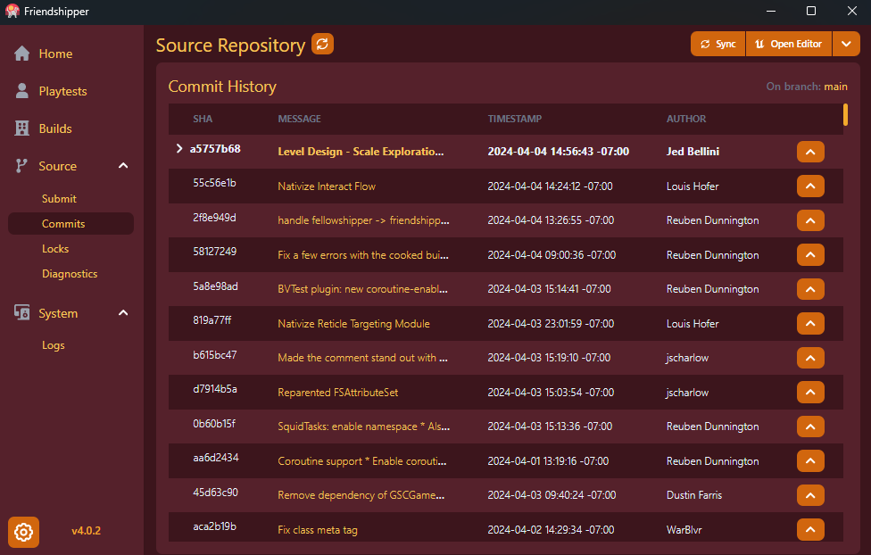
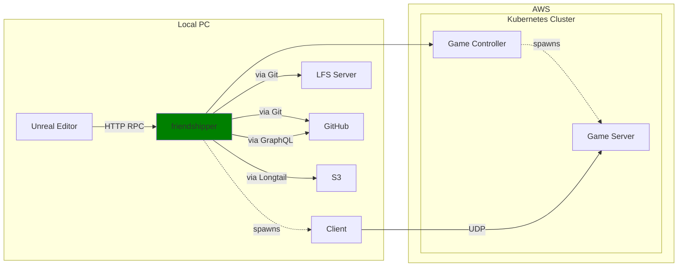
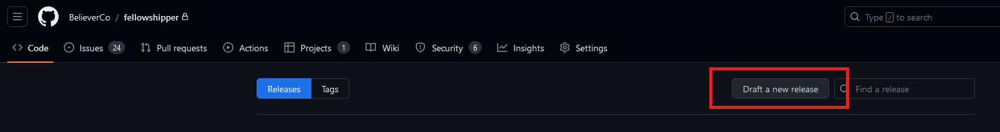
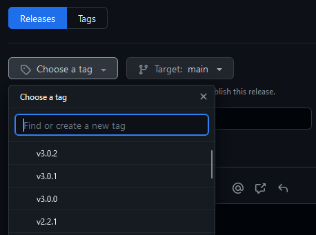
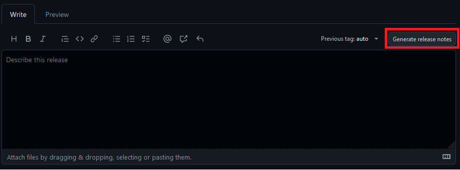

<p align="center">
  
</p>
<h1 align='center'>Friendshipper</h1>

Friendshipper is a desktop application for managing Unreal Engine project source control through Git. It:

- Uses [longtail](https://github.com/DanEngelbrecht/golongtail) to download builds of the game client.
- Interacts with [f11r-operator](https://github.com/believer-oss/f11r-operator) to create game servers and facilitate
  playtests.
- Provides a local backend for interfacing with Git. This backend is used by both the desktop application in this repo,
  and the
  FriendshipperSourceControl plugin for Unreal, which lives [here](https://github.com/believer-oss/FriendshipperSourceControl).



# Architecture

Friendshipper is built as a single static executable. We use [Tauri](https://tauri.app/) for UI, which is a framework
for writing Rust apps with a web-stack frontend. We use [Svelte](https://svelte.dev/) in the frontend.



## Code Organization

There are a few internal libs that are built into friendshipper:

- `friendshipper/` - the Friendshipper UI and backend
- `birdie` - A PoC art pipeline tool
- `ethos-core/`: Code shared between various applications

# Development

## Prerequisites

Friendshipper uses several pieces of tech that you’ll need to have before beginning development. These instructions
assume you’re using Windows.

### Install Rust

`rustup` is the Rust language toolchain updater. It primarily manages `rustc`, the compiler, and `cargo`, the build
system and package manager. You can install it from this webpage:

https://www.rust-lang.org/tools/install

Or directly from this link:

https://static.rust-lang.org/rustup/dist/x86_64-pc-windows-msvc/rustup-init.exe

After installing, ensure the installation directory `cargo\bin` is on your PATH. You can ensure it’s working if you can
run `rustup` from a terminal.

Run this command to make sure you have the latest version of the tools: `rustup update`

### Install Node.js

You can download the installer from this page: https://nodejs.org/en/download

Or directly from this link: https://nodejs.org/dist/v20.9.0/node-v20.9.0-x64.msi

### Install Yarn

We use yarn to manage the javascript packages used in the web frontend. Run this command to install it:

`npm install -g yarn`

## First Time Build

For the first run, you'll need to download `core` packages as well as `friendshipper` ones:

```bash
pushd core/ui
yarn
popd
pushd friendshipper
yarn
```

## Build and Run

To run the app, simply:

```bash
cd friendshipper
yarn tauri:dev
```

You should see `cargo` build a bunch of packages, and once the rust build is finished, some output like this in the
terminal:

```
D:\repos\ethos\friendshipper> yarn tauri:dev
yarn run v1.22.19
warning ..\..\package.json: No license field
$ tauri dev
     Running BeforeDevCommand (`yarn dev`)
warning ..\..\package.json: No license field
$ vite dev

  VITE v4.5.0  ready in 538 ms

  ➜  Local:   http://localhost:5173/
  ➜  Network: use --host to expose
```

Eventually the main UI window will appear, and you should be able to use Friendshipper as normal.

### Hot-reloading

Our project is set up to take advantage of Tauri's hot-reloading feature. When saving changes to:

- Rust code: The application will automatically be killed, rebuilt, and launched
- Frontend (web UI): Tauri will reload the page in-place, making it very fast to iterate on UI.

### Getting ready for commit

We leverage an autoformatter to simplify avoid bikeshedding over formatting. You’ll need to run these two commands
before checking in.

```bash
yarn format
yarn lint
```

# Release Process

We use GitHub to distribute new releases of Friendshipper, according to the [semantic versioning](https://semver.org/)
scheme. Friendshipper will look at GitHub releases and notify the user when a new version is available to auto-update.
To do this, we’ll need to tag a release and make a new release in GitHub.

In this example, we’ll make a new release for v4.0.0.

### Update config files

Run the [Update App Version](https://github.com/believer-oss/friendshipper/actions/workflows/release.yml) workflow in
GitHub Actions, specifying `4.0.0` as the version. This workflow will automatically open a Pull Request that updates all
the files that need to be modified with the new version number. Make sure this Pull Request is approved, then merge it.

### Draft and publish release in GitHub

Navigate to the releases page:

https://github.com/believer-oss/ethos/releases

Select `Draft a new release`



Choose the tag you just pushed up:



Then select `Generate release notes`. Github will fill in the title and release notes with all commit titles since the
last release. This is usually all we do for release notes - hopefully the commit notes are good enough. :)



Finally, all that’s left to do is publish the release.


Our GitHub CI will automatically associate the appropriate files with the relesae, so all you’ll need to do is wait
until the files appear in the Assets list.
